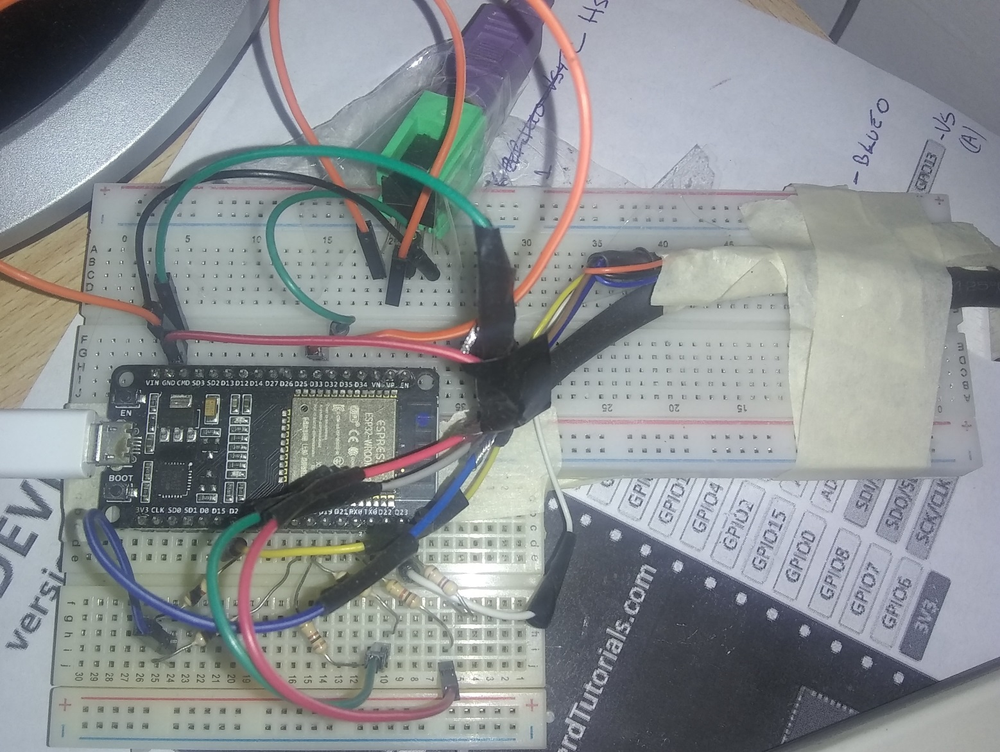

# esp32 forth computer

Computer made with ESP32 microcontroler

* Use https://github.com/fdivitto/fabgl (with a modification)
* Inspired by JupiterAce computer
* Inspired by ColorForth language

## words

System 

```

WORDS             | see dictionary
.S                | see data stack
DIR               | see filesystem 
"filename" CLOAD  | Load code
"filename" CSAVE  | save code
CNEW              | reset machine

```

## Development Videos

https://www.youtube.com/channel/UCuhMgPZP7KoZFkoVAUyhw4A

## Modification of FabGl libary

m_HVSync make public to calculate sync without make color (separate components)
m_isr_handle for disable vga generation and use SPIFFS without errors

in: src/dispdrivers/vgabasecontroller.h
```
  void setRawPixel(int x, int y, uint8_t rgb)    { VGA_PIXEL(x, y) = rgb; }

  // contains H and V signals for visible line
  volatile uint8_t       m_HVSync;                // this two vars are move from above 
  intr_handle_t          m_isr_handle;            // convert from protected to public for use
  
protected:
```

## ESP32 and conections

 
